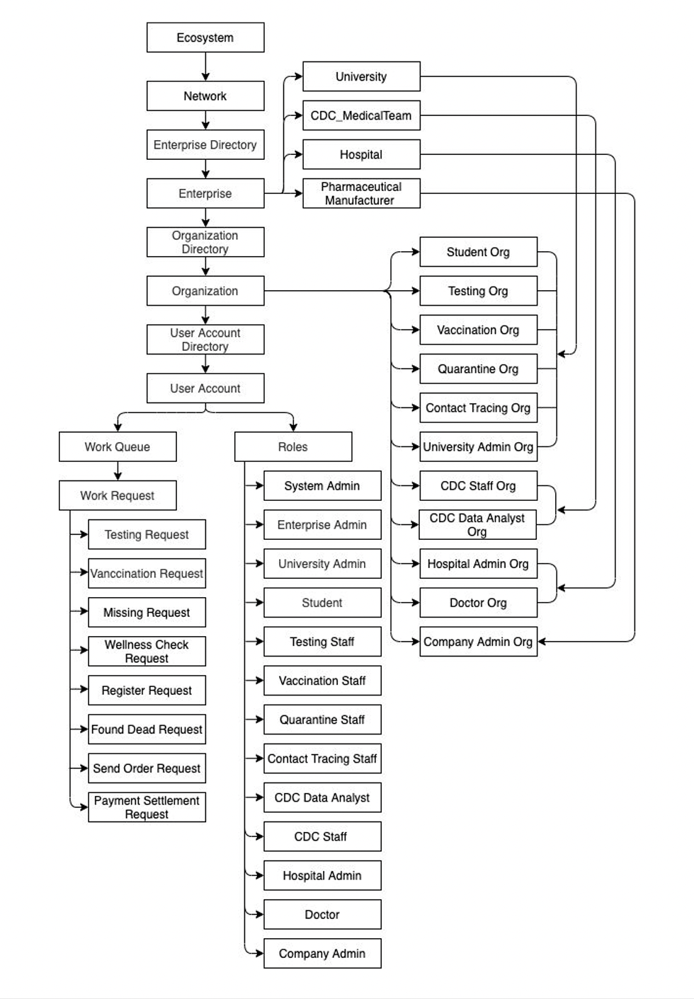
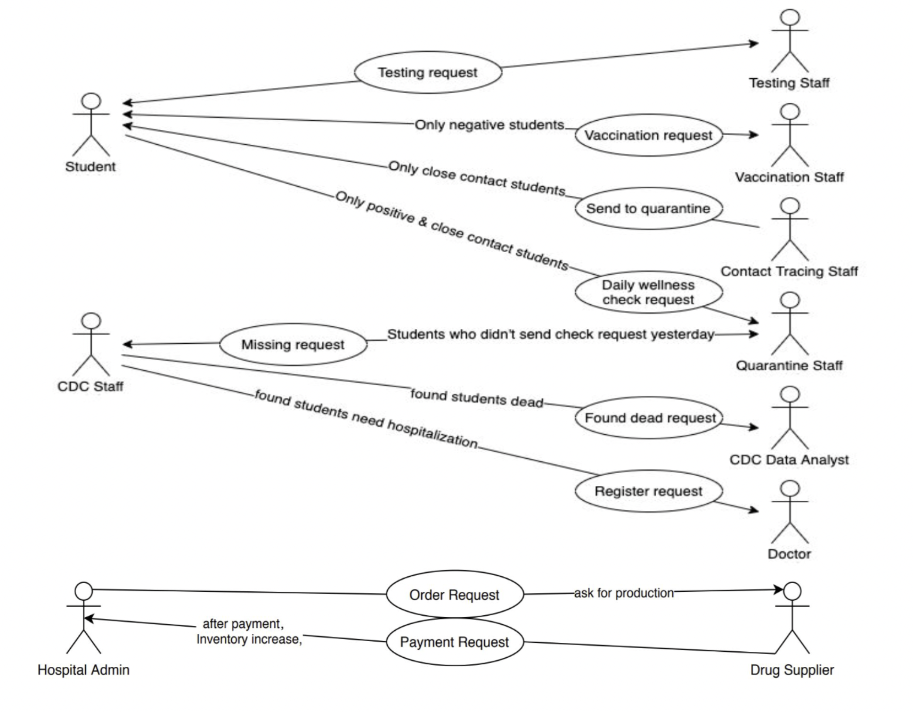

# COVID-19-Management-System-For-University
This project aims to help universities to manage Covid-19 at campus from testing to vaccination, from quarantine to hospitalization. The flow is based on the current covid-19 testing flow at Northeastern University. We extends the flow so that the university not only can track testing results, they can send positive students to quanrantine, and further send severe students to hospitals. This GUI application is a NetBeans project and we use DB4O as objects database.

## The Ecosystem 
The ecosystem involves 4 enterprises, 11 organizations, 13 roles and 8 work requests.

  

## Flow Diagram

  

